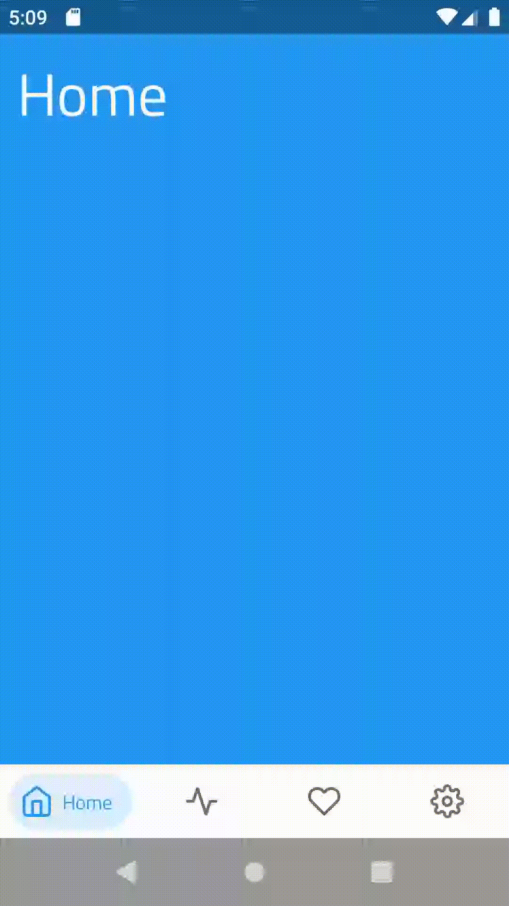
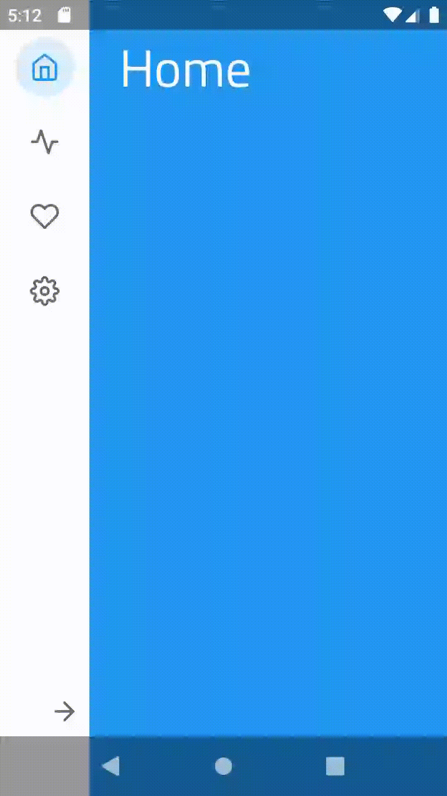

[](https://jitpack.io/#ismaeldivita/chip-navigation-bar)

# Chip Navigation Bar
A navigation bar widget inspired on Google [Bottom Navigation](https://material.io/design/components/bottom-navigation.html) mixed with [Chips](https://material.io/design/components/chips.html) component.

## Usage


```xml
<!-- bottom_menu.xml -->
<menu xmlns:android="http://schemas.android.com/apk/res/android"
    xmlns:app="http://schemas.android.com/apk/res-auto">
    <item
        android:id="@+id/home"
        android:icon="@drawable/ic_home"
        android:title="Home"
        app:cnb_iconColor="@color/home"/>
    <item
        android:id="@+id/activity"
        android:icon="@drawable/ic_activity"
        android:title="Activity"
        app:cnb_iconColor="@color/activity"/>
    <item
        android:id="@+id/favorites"
        android:icon="@drawable/ic_heart"
        android:title="Favorites"
        app:cnb_iconColor="@color/favorites" />
    <item
        android:id="@+id/settings"
        android:icon="@drawable/ic_settings"
        android:title="Settings"
        app:cnb_iconColor="@color/settings" />
</menu>

<!-- layout.xml -->
<com.ismaeldivita.chipnavigation.ChipNavigationBar
    android:layout_width="match_parent"
    android:layout_height="wrap_content"
    android:layout_gravity="bottom"
    android:background="@color/white"
    app:cnb_menuResource="@menu/bottom_menu" />
```
<br clear="right"/>

## Vertical orientation

`ChipNavigationBar` supports a vertical orientation mode. This is very useful for
tablets or devices with large screens.



Just add the attribute `cnb_orientationMode` to your xml:
```xml
<com.ismaeldivita.chipnavigation.ChipNavigationBar
    android:id="@+id/bottom_menu"
    android:layout_width="wrap_content"
    android:layout_height="match_parent"
    app:cnb_menuResource="@menu/test"
    app:cnb_orientationMode="vertical" />
```
... or programmatically call the method `setMenuOrientation` before inflate the menu:
```kotlin
menu.setMenuOrientation(MenuOrientation.VERTICAL)
menu.setMenuResource(R.menu.my_menu)
```

 >**Note:** The view exposes methods to expand and collapse the menu but we don't provide the implementation for the toggle button. Check the sample for a basic implementation.

 <br clear="right"/>

## Badges
The library supports badges on the menu items.


```kotlin
menu.showBadge(R.id.menu_home) 
menu.showBadge(R.id.menu_activity, 8)
menu.showBadge(R.id.menu_favorites, 88)
menu.showBadge(R.id.settings, 10000)
```

## XML custom attributes

### MenuItem xml custom attributes
| attribute|description|default|
|----------|-------------|------ |
| `android:id`|id|**required**|
| `android:enabled`|enabled state|true|
| `android:icon`|icon drawable|**required**|
| `android:title`|label string|**required**|
| `cnb_iconColor`|color used to tint the icon on selected state|`R.attr.colorAccent`|
| `cnb_iconTintMode`|`PorterDuff.Mode` to apply the color. Possible values: [src_over, src_in, src_atop, multiply, screen]|`null`|
| `cnb_textColor`|color used for the label on selected state|same color used for `cnb_iconColor`|
| `cnb_backgroundColor`|color used for the chip background|same color used for `cnb_iconColor` with 15% alpha

```xml
<menu xmlns:android="http://schemas.android.com/apk/res/android"
    xmlns:app="http://schemas.android.com/apk/res-auto">

    <item
        android:id="@+id/home"
        android:enabled="true"
        android:icon="@drawable/ic_home"
        android:title="@string/home"
        app:cnb_backgroundColor="@color/home_chip"
        app:cnb_iconColor="@color/home_icon"
        app:cnb_iconTintMode="src_in"
        app:cnb_textColor="@color/home_label" />

        ...

</menu>
```

### ChipNavigationBar xml custom attributes
| attribute|description|default|
|----------|-------------|------ |
| `cnb_menuResource`|menu resource file|optional since you can set this programmatically|
| `cnb_orientationMode`|menu orientation. Possible values: [horizontal, vertical]|horizontal|
| `cnb_addBottomInset`|property to enable the sum of the window insets on the current bottom padding, useful when you're using the translucent navigation bar|false|
| `cnb_addTopInset`|property to enable the sum of the window insets on the current bottom padding, useful when you're using the translucent status bar with the vertical mode|false|
| `cnb_addLeftInset`|property to enable the sum of the window insets on the current start padding, useful when you're using the translucent navigation bar with landscape|false|
| `cnb_addRightInset`|property to enable the sum of the window insets on the current end padding, useful when you're using the translucent navigation bar with landscape|false|
| `cnb_minExpandedWidth`|minimum width for vertical menu when expanded|0
| `cnb_unselectedColor` |color used for unselected state|`#696969`|
| `cnb_badgeColor` |color used for the badge|`#F44336`|
| `cnb_radius` |radius used on the background|`Float.MAX_VALUE` fully rounded|
| `cnb_iconSize` |menu item icon size|24dp|
| `cnb_textAppearance` |menu item text appearance|theme default|
| `cnb_animationDuration` |animation duration|theme default|
```xml
<com.ismaeldivita.chipnavigation.ChipNavigationBar
    android:id="@+id/menu"
    android:layout_width="match_parent"
    android:layout_height="wrap_content"
    app:cnb_menuResource="@menu/bottom_menu"
    app:cnb_orientationMode="horizontal"
    app:cnb_addBottomInset="false"
    app:cnb_addLeftInset="false"
    app:cnb_addRightInset="false"
    app:cnb_addTopInset="false"
    app:cnb_unselectedColor="@color/my_menu_unselected_color"
    app:cnb_badgeColor="@color/my_menu_badge_color"
    app:cnb_radius="8dp"
    app:cnb_iconSize="24dp"
    app:cnb_textAppearance="?myThemeTextAppearance"
    app:cnb_animationDuration="175">
```
## Public API

| method|description|
|---------------|----|
|`setMenuResource(@MenuRes menuRes: Int)` | Inflate a menu from the specified XML resource|
|`setMenuOrientation(menuOrientation: MenuOrientation)` | Set the menu orientation|
|`setItemEnabled(id: Int, isEnabled: Boolean)` | Set the enabled state for the menu item with the provided [id]|
|`setItemSelected(id: Int)` | Remove the selected state from the current item and set the selected state to true for the menu item with the [id]|
|`setOnItemSelectedListener(listener: OnItemSelectedListener)`|Register a callback to be invoked when a menu item is selected|
|`collapse()`|Collapse the menu items if orientationMode is VERTICAL otherwise, do nothing|
|`expand()`|Expand the menu items if orientationMode is VERTICAL otherwise, do nothing|
|`showBadge(id: Int)`|Display a numberless badge for the menu item with the [id]|
|`showBadge(id: Int, count: Int)`|Display a countable badge with for the menu item with the [id]|
|`setDuration(duration: Long)`|Set a custom animation duration|
## Installation

**Required**
- AndroidX - See [migration guide](https://developer.android.com/jetpack/androidx/migrate)
- Android Marshmallow - API Level [23](https://twitter.com/minsdkversion)

### Gradle

Make sure that the repositories section includes Jitpack
```gradle
allprojects {
    repositories {
        ...
        maven { url 'https://jitpack.io' }
    }
}
```
Add the library to the dependencies:

```gradle
implementation 'com.github.ismaeldivita:chip-navigation-bar:1.4.0'
```
 >**Note:** For projects without kotlin, you may need to add `org.jetbrains.kotlin:kotlin-stdlib:$kotlinVersion` to your dependencies since this is a Kotlin library.

## License
MIT License

Copyright (c) 2019 Ismael Di Vita

Permission is hereby granted, free of charge, to any person obtaining a copy
of this software and associated documentation files (the "Software"), to deal
in the Software without restriction, including without limitation the rights
to use, copy, modify, merge, publish, distribute, sublicense, and/or sell
copies of the Software, and to permit persons to whom the Software is
furnished to do so, subject to the following conditions:

The above copyright notice and this permission notice shall be included in all
copies or substantial portions of the Software.

THE SOFTWARE IS PROVIDED "AS IS", WITHOUT WARRANTY OF ANY KIND, EXPRESS OR
IMPLIED, INCLUDING BUT NOT LIMITED TO THE WARRANTIES OF MERCHANTABILITY,
FITNESS FOR A PARTICULAR PURPOSE AND NONINFRINGEMENT. IN NO EVENT SHALL THE
AUTHORS OR COPYRIGHT HOLDERS BE LIABLE FOR ANY CLAIM, DAMAGES OR OTHER
LIABILITY, WHETHER IN AN ACTION OF CONTRACT, TORT OR OTHERWISE, ARISING FROM,
OUT OF OR IN CONNECTION WITH THE SOFTWARE OR THE USE OR OTHER DEALINGS IN THE
SOFTWARE.
